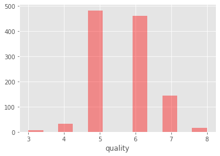
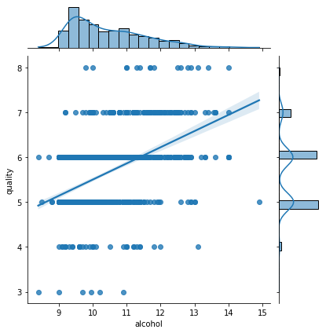
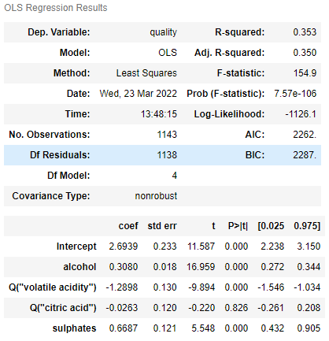

# Wine Quality Classification with Machine Learning

## Overview
* Created a machine learning classification model to to predict wine quality (67% accuracy), based on the wines' chemical characteristics.
* Used statistical analysis (multiple linear OLS regression) to highlight key predictors of quality.
* Built and compared three models: Multinomial Logistic Regression, Decision Tree and Random Forest classifiers.
* Optimized the models with GridSearchCV to tune hyperparameters and reach the best model.

## Code and Resources Used

**Programming Language:** Python  
**Packages:** pandas, numpy, scikit-learn, statsmodels, seaborn, matplotlib  
**Dataset Source:** https://www.kaggle.com/datasets/yasserh/wine-quality-dataset

## EDA

I looked at the distributions of the data (such as wine quality) and checked the correlations between the variables and visuzalised them in bar plots and a heat map. I also took the variables which had the highest correlations with quality and created plots with them and wine queality. Below is a highlight of the distribution of wine quality, the correlation heat map and a scatterplot of quality and alcohol.

## Statistical Analysis

To investigate whether any wine characteristic had a statistically significant relationship with wine quality, I took those variables which had the highest correlation with quality and put them in a multiple linear OLS regression and summarized the results, which can be seen in the figure below.

## Model Building

First I scaled the feature data to improve the training of the models.

Then I tried three different models:
* Multionomial Logistic Regression
* Random Forest Classifier
* Decision Tree Classifier

## Model Performance
