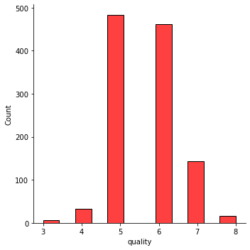

# Wine Quality Classification with Machine Learning

## Overview
* Statistical inference with Multiple Linear Regression
* Created a Multinomial Logistic Regression machine learning model to predict wine quality based on characteristics
* Used K-Fold cross-validation to reach the best model

## Code and Resources Used

**Programming Language:** Python  
**Packages:** pandas, numpy, scikit-learn, stats...  
**Dataset Source:** https://www.kaggle.com/datasets/yasserh/wine-quality-dataset

## EDA

## Statistical Analysis

## Model Building

First I scaled the feature data to improve the training of the models.

Then I tried three different models:
* Multionomial Logistic Regression
* Random Forest Classifier
* Decision Tree Classifier

## Model Performance
